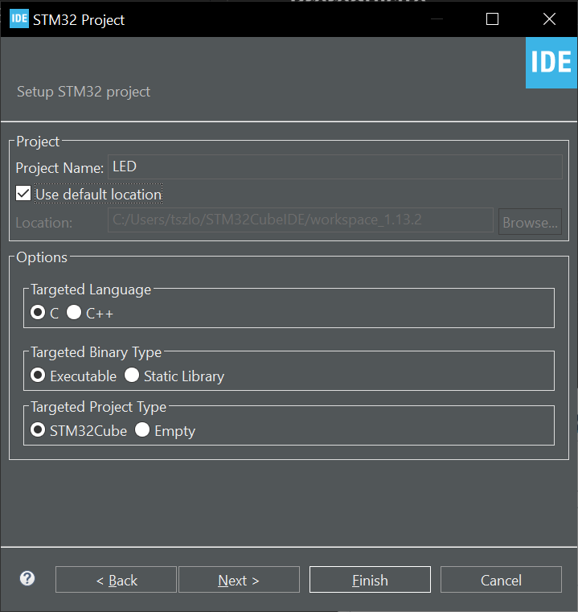

## Summary
- This is a guide on how to install and flash a simple LED blinking problem on any stm32 variant
- This guide will use `NUCLEO-G474RE` board as example
- This guide is for **WINDOW** machine (though on linux/mac should be similar)
- Please read this in markdown compatible reader


## Prerequisite
- A stm32 board and stlink
- [STM32CubeIDE](https://www.st.com/en/development-tools/stm32cubeide.html)
- (Optional) A [st.com accout](https://www.st.com/cas/login?lang=en&service=https%3A%2F%2Fwww.st.com%2Fcontent%2Fst_com%2Fen.html) 


## Project setup
1. Open `STM32CubeIDE` and select `start new STM32Project`
2. Select the variant and click `Next` in the bottom right 

3. Enter the project name and click `finish`

4. Select `System Core` -> `GPIO` from the menu on the right

5. The STM32CubeMX already configured the PA5 LED pin for us as we select `NUCLEO-G474RE` as our board (Otherwise, all pinout for other non-dev board variant will be disable by default)

6. Go to `Core/Src/main.c` and write the LED blinding code
```C
...

  /* USER CODE BEGIN 2 */

  /* USER CODE END 2 */

  /* Infinite loop */
  /* USER CODE BEGIN WHILE */
  while (1)
  {
    /* USER CODE END WHILE */
    /* USER CODE BEGIN 3 */
	  HAL_GPIO_TogglePin(LD2_GPIO_Port, LD2_Pin);
	  HAL_Delay(100);
  }
  /* USER CODE END 3 */
}
...

```
7. Connect STM32 to the PC using STLink
8. Click the Green Run button to flash 


9. Done :D


## G474 Programming Docs
- [RM0440 Reference manual](https://www.st.com/resource/en/reference_manual/rm0440-stm32g4-series-advanced-armbased-32bit-mcus-stmicroelectronics.pdf)
- [UM2570 hal and low-layer drivers manual](https://www.st.com/resource/en/user_manual/um2570-description-of-stm32g4-hal-and-lowlayer-drivers--stmicroelectronics.pdf)
- [AN4539 HRTIM cookbook](https://www.st.com/resource/en/application_note/an4539-hrtim-cookbook-stmicroelectronics.pdf)
- [G474 Code examples](https://github.com/STMicroelectronics/STM32CubeG4/tree/master/Projects/NUCLEO-G474RE/Examples)


## If you prefer using other editors
- This method basically boil down to using the `STM32CubeMX` for code and makefile generation, `openocd` for flashing and your prefered editor (e.g. VScode) for programming
- But it requires lots of plugins and setup to work, especially for the stlink debugger function (search `stm32 cortex debug` for more details)
- Also it's easier to setup on linux/mac than window as they have native C/C++ compiler
- Here're 3 videos for basic setup
    - [STM32 toolchain for Windows - Part 1](https://www.youtube.com/watch?v=PxQw5_7yI8Q)
    - [Visual Studio Code for STM32 development and debugging - Part 2](https://www.youtube.com/watch?v=xaC5oWwzOt0)
    - [VSCode intellisense and make setup](https://www.youtube.com/watch?v=jcy5TpbXfAY)

## Building the slides
```bash
nix develop
markdown-to-slides slide.md -s blue_standard.css -o index.html
```