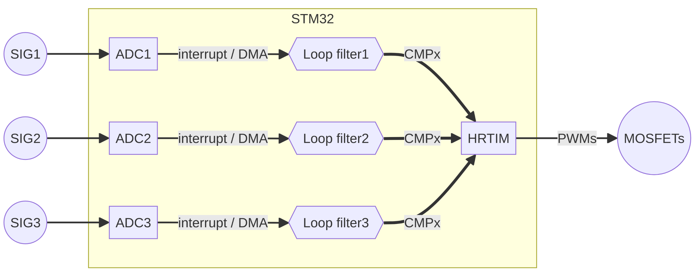

class: title

# Digital control on STM32

---

## Intro
### Content
- Background on digital controller
- Primer for STM32 ADC & HRTIM
- STM32 toolchain
- Simple flashing demo

.center[.image-small[]]

---
## Digital controller

### Requirement
- Accurate ADC
- Processing power for loop filter
- Arbitrary PWM generator

.center[.image-small[]]

---
## Controller selection

### MCU: STM32 with HRTIM
- E.g. NUCLEO-G474RE (Mouser HK$132.10)
- In C/C++ or embedded-Rust
- Easier to learn but hard to be timing accurate

### FPGA: Xilinx Zynq 
- E.g. PYNQ-Z2 (Mouser HK$1,900.88)
- In python (PYNQ) or V*HDL language
- Harder to learn but easier to implement timing critical application

.center[
.image-tiny[]
.image-tiny[]
]

---
## STM32 hardware
### ADC
- 5 ADCs but some pins are shared with other IOs 
- 12bit@60MHz, minium sampling cycle = 2.5 CLK cycle 
- usually 3.3V (check datasheet for other variants)
- Can use DMA (Direct memory access) without wasting processor time

.center[.image-small[]]

---
## STM32 hardware 
### HRTIM
- 6 channels with 2 outputs each
- 184 ps resolution
- Arbitrary PWM generator

.center[.image-small[]]

---
## STM32 hardware 

- CMPX (compare) == counter, IO can be set to
    - ON
    - OFF
    - Toggle
- 7 timers with 4+4 CMPs
    - Master timer: no IO but provides 4 CMPs to all timer
    - A-F timer: each has 4 CMPs

.center[.image-small[]]

---
## Block diagram example

### Three input example
- SIGx: direct voltage out or divider using resistor
- DMA: save CPU time for loop filter
- Loop filter: PI/PD controller

.center[.image-small[]]

---
## Toolchain

### stm32cubeide
- Code generation and eclipse editor

### stm32cubemx + openocd + any editor
- stm32cubemx: code generation
- openocd: flashing and debugger support

.center[.image-small[]]

---
class: blank

.vertical-center.center[ 
# IDE Demo time
.image-small[]
]

---
## Other resource 
- [RM0440 Reference manual](https://www.st.com/resource/en/reference_manual/rm0440-stm32g4-series-advanced-armbased-32bit-mcus-stmicroelectronics.pdf)
- [UM2570 hal and low-layer drivers manual](https://www.st.com/resource/en/user_manual/um2570-description-of-stm32g4-hal-and-lowlayer-drivers--stmicroelectronics.pdf)
- [AN4539 HRTIM cookbook](https://www.st.com/resource/en/application_note/an4539-hrtim-cookbook-stmicroelectronics.pdf)
    - with DC-DC converters examples
- [G474 Code examples](https://github.com/STMicroelectronics/STM32CubeG4/tree/master/Projects/NUCLEO-G474RE/Examples)
